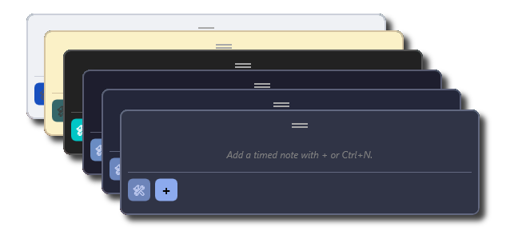

# QuickTimers

Minimalist Windows timer manager. Global shortcut and simple-to-use functionality.



## Table of Contents

* [Overview](#overview)
* [Features](#features)
* [Getting Started](#getting-started)

  * [Installation](#installation)
  * [Uninstall](#uninstall)
* [Usage](#usage)
* [Contribution Guidelines](#contribution-guidelines)
* [Contact](#contact)
* [License](#license)

---

# Overview

QuickTimers is a minimal Windows timer manager built with .NET 8 WPF that lets you manage scheduled reminders and timed alerts from a lightweight, always-accessible overlay.

The application is designed to stay out of your way — hiding when not in use and summoned instantly via a global hotkey.
It runs entirely locally with no external services or dependencies beyond the .NET runtime, and stores your timers as simple JSON files in your AppData folder.

---

# Features

* **Global Hotkey Access** — Open and close QuickTimers from anywhere on your system with a fully customizable hotkey *(default: Ctrl+Alt+/)*.
* **Timer Groups** — Organize timers into collapsible groups. Drag timers onto group headers to assign them, double-click a group to rename it inline, and star groups to pin them to the top.
* **Star & Prioritize** — Star individual timers to highlight them with a ❗ marker and sort them above the rest within their group.
* **Toast Notifications** — When a timer fires, a toast notification appears with **Dismiss** and **Complete** actions. Hovering pauses the auto-dismiss countdown. If ignored, a follow-up notification fires minutes.
* **Scheduled Triggers** — Set a specific date and time for each timer. A live countdown label refreshes every 10 seconds so you always know what's coming up next.
* **Multiple Color Themes** — Choose from 9 built-in themes including Dark, Light, Dracula, Gruvbox, and all four Catppuccin variants.
* **Persistent Window Position** — QuickTimers remembers where you left it on screen between sessions.

---

# Getting Started

## Installation

### Option 1: Use the Prebuilt Release

1. **Download the prebuilt package** from the [Releases](../../releases) page.

- Choose the StableBuild `.zip` file for the **latest stable package**.
- Extract the contents of the `.zip` to any folder of your choice.
- Follow the instructions in the `README.md` included within the package for any additional setup notes.

2. **After running the `.exe` file** once, configuration files will initialize under:

```
%AppData%\QuickTimers\
```


---

### Option 2: Build from Source

If you prefer building QuickTimers yourself:

1. **Clone the repository**

```
git clone https://github.com/Ventexx/QuickTimers.git
cd QuickTimers/src
```

2. **Build the project**

```
dotnet build -c Release
```

3. **Run the application**

```
dotnet run
```

4. **Locate the compiled executable**

The compiled files will be located in:

```
QuickTimers/bin/Release/net8.0-windows/
```

Run the application using:

```
QuickTimers.exe
```

The executable depends on the files inside this directory and should not be moved separately.

---

## Uninstall

To remove QuickTimers:

* Delete the application folder.

Configuration and user data is stored under:

```
C:\Users\<USERNAME>\AppData\Roaming\QuickTimers\
```

---

# Usage

Press the global hotkey to open QuickTimers. (Default: Ctrl+Alt+/)

Click the + button or press Ctrl+N to add a new timer.

Set a trigger date and time when creating or editing a timer.

Double-click any timer to edit it.

Right-click a timer for Rename, Set group, Star, or Delete.

Right-click a group header for Star group or Rename group.

When a timer fires, click **Complete** to mark it done or **Dismiss** to silence it. Hovering over the notification pauses its auto-dismiss timer.

You can change the global hotkey and switch between color themes in the Settings menu.

---

# Contribution Guidelines

Contributions are welcome.

Please follow the **Conventional Commits** specification when submitting changes:

https://www.conventionalcommits.org/

---

# Contact

**Maintainer:** Ventexx
Email: [enquiry.kimventex@outlook.com](mailto:enquiry.kimventex@outlook.com)

---

# License

QuickTimers © 2026 by Ventexx is licensed under **CC BY-NC 4.0**.

To view a copy of this license, visit:
https://creativecommons.org/licenses/by-nc/4.0/
